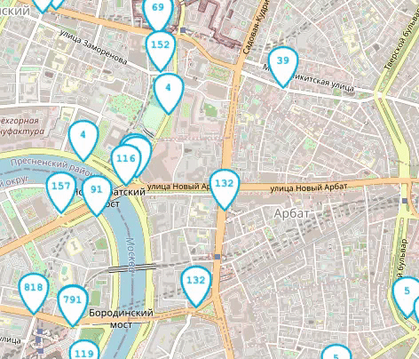
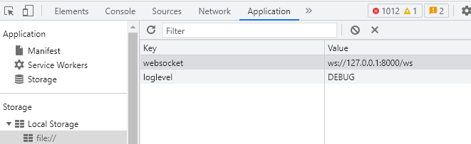

# Buses on the map

This web application renders the movement of buses on the map. The application consists of a server, a bus emulator and a web browser. The emulator sends coordinates of moving buses to the server. The browser sends visible bounds of the map to the server. The server sends the coordinates of the buses that are inside the bounds to the browser. The browser renders the movement of the buses on the map.



## Prerequisites

Python 3.11 is required.

## Installing

- Download the project files.
- It is recommended to use [venv](https://docs.python.org/3/library/venv.html?highlight=venv#module-venv) for project isolation.
- Set up packages:

```bash
pip install -r requirements.txt
```

## Using

### Quick start

- Run a web browser and open the file "index.html";
- Run the server:

```bash
python server.py
```

- Run the bus emulator:

```bash
python fake_bus.py
```

- You will see the movement of buses on the map in the browser window.

### Advanced usage

#### Server

- You can specify the address of the server, the port to listen to buses, the port to talk to the browser, the verbose mode, the refresh timeout, for example:

```bash
python server.py -s 127.0.0.1 -bup 8080 -brp 8000 -v -rt 0.1
```

- To find out more about the command line interface of the server, run:

```bash
python server.py --help
```

#### Emulator

- You can specify the address of the server, the number of routes, the number of buses per route, the number of opened web sockets, the emulator ID, the refresh timeout, the verbose mode, the path to JSON files of the routes, for example:

```bash
python fake_bus.py -s ws://127.0.0.1:8080/ -rn 20 -bpr 7 -eid abc -rt 2 -v -rp routes
```

- To find out more about the command line interface of the emulator, run:

```bash
python fake_bus.py --help
```

#### Browser

- You can specify the server address and set the debug mode in the lower right corner:


- The settings are stored at Local Storage of the browser. To reset the settings, go to Chrome Dev Tools —> Application tab  —> Storage —> Local Storage:



## Data format

- The bus sends its coordinates to the server :

```json
{
  "busId": "2805954e-7419-4619-b2d6-430311d0f08f-228-2",
  "lat": 55.672566612157,
  "lng": 37.807759761846,
  "route": "228"
}
```

- The browser tracks the user's movement on the map and sends bounds of the window to the server:

```json
{
  "msgType": "newBounds",
  "data": {
    "east_lng": 37.65563964843751,
    "north_lat": 55.77367652953477,
    "south_lat": 55.72628839374007,
    "west_lng": 37.54440307617188,
  },
}
```

- The server sends the JSON message with the list of the buses to the browser:

```json
{
  "msgType": "Buses",
  "buses": [
    {"busId": "c790сс", "lat": 55.7500, "lng": 37.600, "route": "120"},
    {"busId": "a134aa", "lat": 55.7494, "lng": 37.621, "route": "670к"},
  ]
}
```

- The buses that are not on the list will be removed from the map.

## Checking incoming messages

- The server validates incoming messages. If an invalid message comes, the server will return an error.

### Script harmful_bus.py

- The script emulates a bus that sends invalid messages;
- Run:

```bash
python harmful_bus.py
```

- You will see messages about errors from server:

```bash
WARNING:root:Received message: {"errors": ["Requires valid JSON"], "msgType": "Errors"}
WARNING:root:Received message: {"errors": ["Requires busId specified"], "msgType": "Errors"}
```

### Script harmful_client.py

- The script emulates a browser that sends invalid messages;
- Run:

```bash
python harmful_client.py
```

- You will see messages about errors from the server:

```bash
WARNING:root:Received message: {"errors": ["Requires msgType specified"], "msgType": "Errors"}
WARNING:root:Received message: {"errors": ["Requires valid JSON"], "msgType": "Errors"}
```

## The packages used by the frontend

- [Leaflet](https://leafletjs.com/) — rendering of the map
- [loglevel](https://www.npmjs.com/package/loglevel) - logging

## Project goals

The project was created for educational purposes.
It's a lesson for python and web developers at [Devman](https://dvmn.org).
